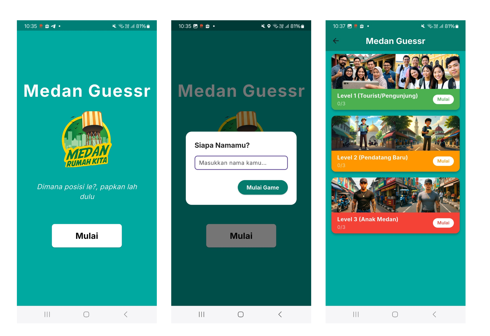
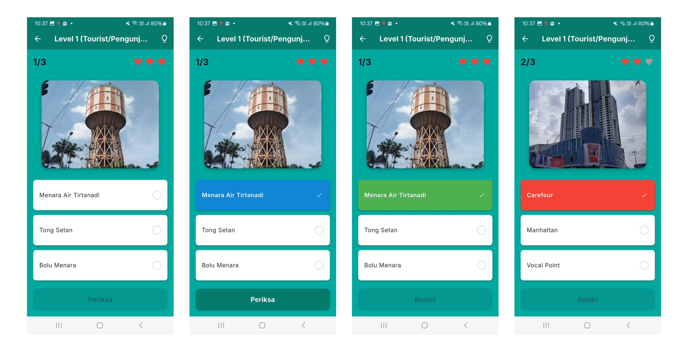
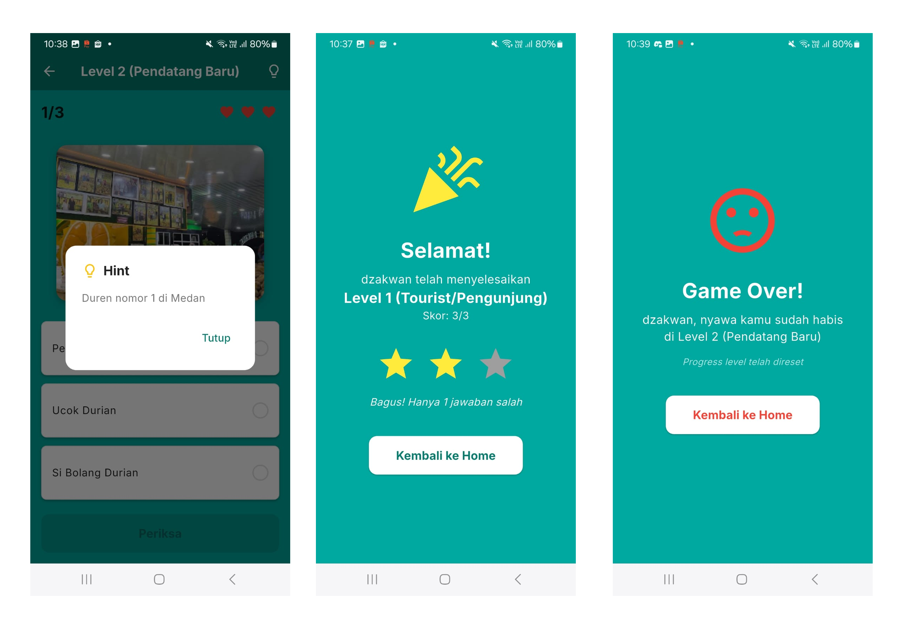

# Introduction

Nama : Muhammad Dzakwan Attaqiy  
NIM : 231401055  
Lab : 2

# App Name

Medan Guessr

# App Description

Medan Guessr adalah permainan kuis bertema pengetahuan lokal yang menantang kamu untuk menebak berbagai tempat ikonik di Kota Medan!
Terinspirasi dari konsep GeoGuessr, game ini mengajakmu berkeliling ke sudut-sudut Medan — mulai dari bangunan bersejarah, tempat nongkrong legendaris, hingga spot yang cuma diketahui Anak Medan.

# Source Credit

Terima kasih kepada berbagai sumber referensi dan media daring yang telah membantu dalam penyusunan konten visual dan informasi lokasi pada aplikasi Medan Guessr.
| No | Nama Tempat | Sumber Referensi |
| -- | ----------------------------------- | --------------------------------------------------------------------------------------------------------------------------------------------------------- |
| 1 | Menara Air Tirtanadi (Menara Medan) | [Tribun News Medan](https://medan.tribunnews.com/2019/06/13/tribun-wiki-mengulik-menara-air-tirtanadi-satu-di-antara-ikon-kota-medan) |
| 2 | Manhattan Times Square Medan | [Facebook – Manhattan Times Square Medan](https://web.facebook.com/photo.php?fbid=1070979819729077&id=758372350989827&set=a.758372744323121&_rdc=1&_rdr#) |
| 3 | Istana Maimun | [Wikipedia – Istana Maimun](https://id.wikipedia.org/wiki/Istana_Maimun) |
| 4 | Ucok Durian | [Google Maps – Ucok Durian](https://maps.app.goo.gl/XT3v5HMT8YwhtkER7) |
| 5 | Kantor Pos Medan | [Detik Travel – Pos Bloc Medan](https://travel.detik.com/domestic-destination/d-6574551/tak-cuma-di-jakarta-pos-bloc-juga-ada-di-medan) |
| 6 | Kantor Gubernur Sumatera Utara | [Tribun News Medan – Sejarah Kantor Gubernur Sumut](https://medan.tribunnews.com/2022/02/12/sejarah-kantor-gubernur-sumut-tempat-penelitian-tembakau-yang-diambil-alih-pemprov-senilai-rp-1000#google_vignette) |
| 7 | Pajak Petisah | [Pariwisata Sumut – Pajak Petisah Medan](https://www.pariwisatasumut.net/2021/02/pajak-petisah-medan.html) |
| 8 | Kampung Keling (Little India) | [Bolumenara.co.id – Kampung Keling](https://bolumenara.co.id/uploads/7/2022-11/kampung_keling_melihat_india_di_kota_medan_img0.png) |
| 9 | Simpang Pos Medan | [Traveling Medan – Simpang Pos](https://www.travelingmedan.com/2020/03/simpang-pos-medan.html) |

# Screenshot App

Berikut adalah tampilan antarmuka dari aplikasi Medan Guessr, mulai dari layar awal hingga permainan berakhir.

### Tampilan Awal

- **Splashscreen**: menampilkan logo Medan Guessr dengan nuansa khas Medan.
- **Input Nama**: pemain memasukkan nama sebelum memulai permainan.
- **Home Screen**: berisi daftar level (Turis, Pendatang Baru, Anak Medan) lengkap dengan ilustrasi, progres, dan status permainan.

### Tampilan Quiz

- **Tampilan awal**: gambar lokasi ditampilkan dengan tiga pilihan jawaban.
- **Saat memilih jawaban**: opsi berubah warna untuk menandakan pilihan aktif.
- **Jawaban salah**: opsi ditandai dengan warna merah dan efek animasi ringan.
- **Jawaban benar**: opsi berubah menjadi hijau disertai efek suara kemenangan.

### Tampilan Akhir

- **Hint**: petunjuk menarik tentang lokasi, bisa berupa sejarah, keunikan, atau ciri khas tempat tersebut.
- **Finish Screen**: muncul setelah pemain menyelesaikan semua soal di satu level, menampilkan skor dan status kelulusan.
- **Game Over**: muncul jika pemain gagal menebak dengan benar pada batas kesempatan tertentu.
